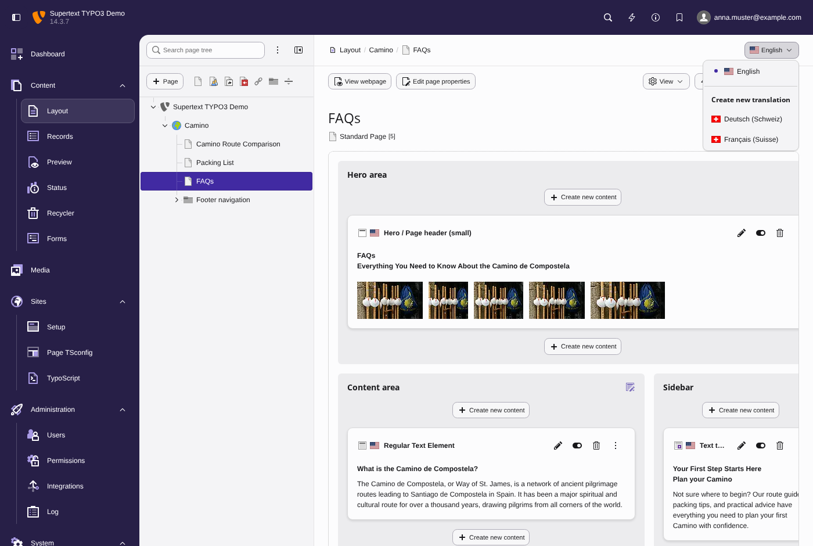
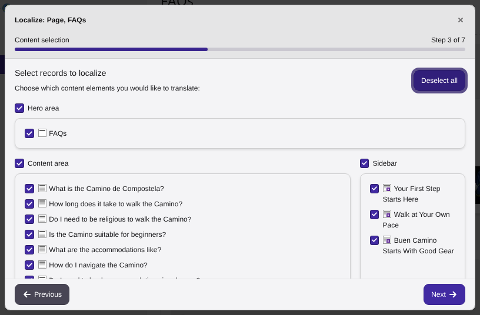
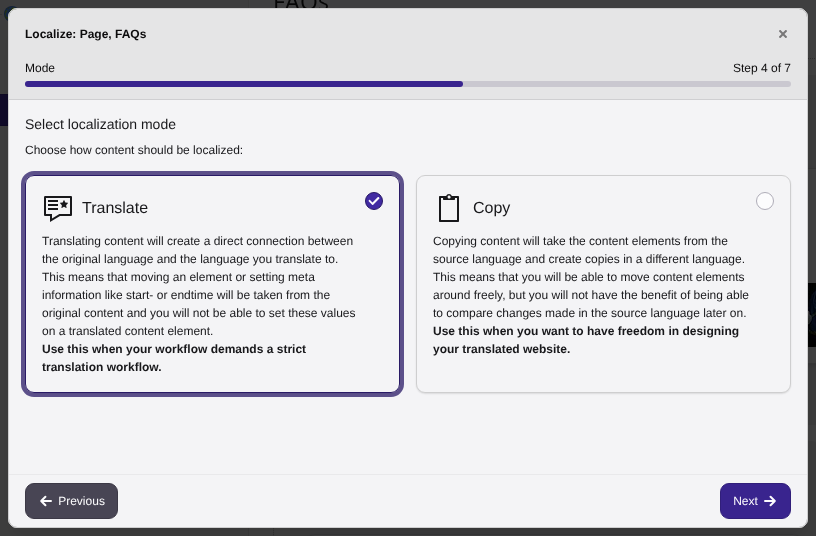
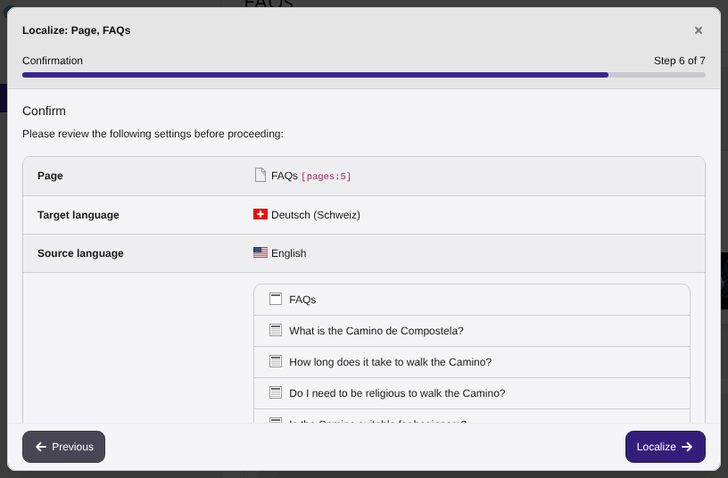
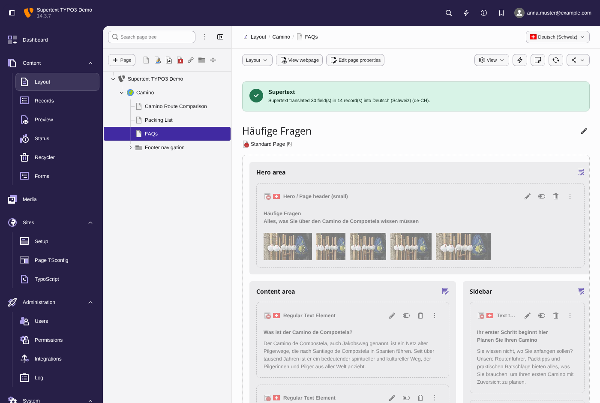

# User guide — Supertext Translation for TYPO3

For editors. Once an administrator has installed the extension (see [INSTALLATION.md](INSTALLATION.md)), you translate content exactly as you always do in TYPO3 — Supertext fills in the text automatically.

## Try it on the demo

The Supertext TYPO3 demo (ask Supertext for the address and a backend login) has a sample website in English with German and French set up as target languages. Translate any page as described below and open the German or French version of the site to see the result. Pages that aren't translated yet show the English text in the German and French versions.

## Translate a page

*Screenshots: TYPO3 14.3 with the Camino demo content.*

1. Open **Content → Layout** and select the page in the page tree.
2. Open the language menu at the top right (it shows the current language, e.g. *English*) and choose the target language under **Create new translation**.

   

3. TYPO3's **Localize** wizard opens. Choose the content elements to translate — all are selected by default — and click **Next**.

   

4. Choose how to localize:
   - **Translate** (connected mode): the translation stays linked to the original. The usual choice.
   - **Copy** (free mode): an independent copy you can restructure freely.

   

5. Check the summary and click **Localize**. Supertext translates the page and the selected elements in this step; it usually takes a few seconds. Then click **Finish**.

   

The page opens in the new language with a green message confirming what Supertext translated, for example *"Supertext translated 30 field(s) in 14 record(s) into Deutsch (Schweiz) (de-CH)."*

**TYPO3 13.4** has no wizard for the page itself: first use **Create new translation of this page**, then the **Translate** button in the language column, which offers the same Translate/Copy choice. Supertext translates in both steps.

## Review and publish

New translations are **hidden** — TYPO3's default — so nothing goes live unreviewed.

1. Read through the translated page and elements, correct anything you'd phrase differently.
2. Unhide the page translation and the content elements (eye icon) when you're happy.

## What gets translated

- Page title, navigation title, subtitle, SEO and social media texts, abstracts
- Content element headers, subheaders and text (formatting, links and lists are kept)
- Image and file captions, alt texts and titles
- Table content, row by row

The page's URL (slug) is rebuilt from the translated title, e.g. `/about-us` → `/de/ueber-uns`.

## What is *not* translated

- **HTML** content elements — the code is copied unchanged.
- Numbers, dates, e-mail addresses, links' targets, colours and other technical fields.
- Content that already has a translation in that language — translating twice never overwrites your edits.

## Formal and informal language

Your administrator can set each language to formal (*Sie/vous*) or informal (*du/tu*). Ask them if the tone doesn't fit your site.

## When something goes wrong

If Supertext can't translate (no API key, network problem, quota reached), you'll see a yellow warning. The records are still created — as untranslated copies with TYPO3's usual *[Translate to …]* prefix — so you can translate by hand, or delete them and try again later.

## Tips

- Translate a whole page at once rather than element by element: it's one request to Supertext and the context makes the translation more consistent.
- To retranslate an element, delete its translation and translate again.
